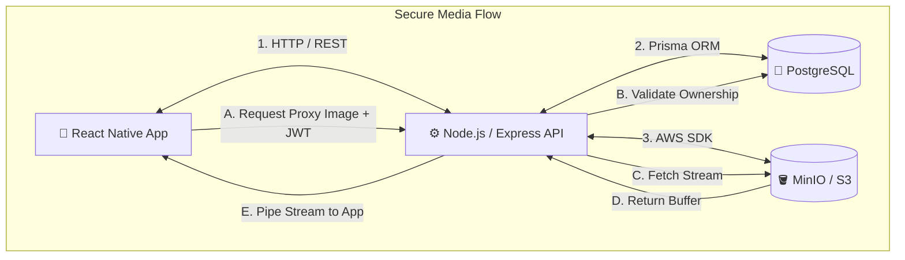
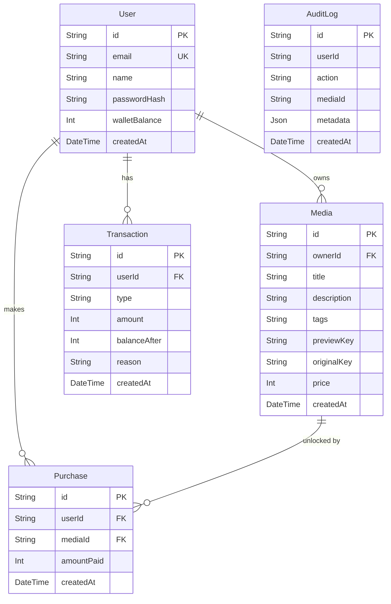

# 🔒 FAZE — Premium Paid Media Locker

> A next-generation backend and mobile system for a premium paid media locker platform. 


Users upload premium images and set an unlock price. Other users can browse slightly degraded/compressed previews for free, but must spend in-app coins from their digital wallet to unlock and stream the crystal-clear original images.

---

## 🏗️ Architecture & Tech Stack

- **Runtime & API**: Node.js + Express + TypeScript
- **Database**: PostgreSQL with Prisma ORM
- **Authentication**: Secure JWT (jsonwebtoken) + bcrypt hashing
- **Data Validation**: Zod schemas for robust payload verification
- **Infrastructure**: Containerized with Docker & docker-compose
- **Storage**: S3-compatible object storage (MinIO) for secure media handling

---

## 🛡️ Security & Privacy Architecture

Security is the primary focus of FAZE to guarantee that creators' premium content is completely protected against unauthorized extraction.

> [!IMPORTANT]
> The backend acts as a **Zero-Trust Secure Stream Proxy**. Direct S3 or CDN links are *never* exposed to the client application, ensuring that original media cannot be scraped, shared, or bypassed.

### Core Security Implementations:

*   **🔒 Strict Access Control**: All media access requests are forcefully routed through the `/api/media/proxy` endpoint, which sits entirely behind our JWT authentication middleware. Unauthenticated requests are immediately rejected.
*   **📦 Private Media Storage**: Original high-resolution files and compressed previews are stored in a private S3 bucket. Public internet access is disabled at the bucket level.
*   **🚫 Direct Access Prevention**: S3 Presigned URLs are handled purely server-side. The Node.js server securely proxies the image buffer stream directly to the authenticated client app.
*   **🛂 Real-Time Ownership Validation**: Before the backend proxy streams any file prefixed with `original-`, it performs a live database transaction via Prisma to verify that the requesting user either natively owns the media or holds a cryptographically valid `Purchase` record.
*   **📱 Secure Mobile Delivery**: The React Native frontend is securely configured to pass the active session's Bearer token inside the HTTP headers of all native `<Image>` components, ensuring the proxy stream is flawlessly authenticated.
*   **🛑 Rate Limiting & Auditing**: Endpoints are rate-limited to prevent brute-forcing (10 req/15 min per IP). All critical transactions and authentication events are written to an Audit Log.

---

## 🚀 Quick Start Guide

### Option 1: Docker Compose (Recommended)

Boot up the entire stack (PostgreSQL, MinIO S3 Mock, and the Node.js API) with a single command. Migrations run automatically.

```bash
docker-compose up --build
```

### Option 2: Local Development Environment

If you prefer running services manually on bare metal:

```bash
# 1. Install Node dependencies
npm install

# 2. Setup environment variables
cp .env.example .env

# 3. Spin up local PostgreSQL instance
docker-compose up postgres -d

# 4. Run Prisma database migrations
npx prisma migrate dev

# 5. Generate Prisma typings
npx prisma generate

# 6. Ignite the development server
npm run dev
```

---

## 📡 Core API Reference

| Method | Endpoint | Auth Required | Description |
| :--- | :--- | :---: | :--- |
| `GET` | `/api/health` | ❌ | API health check & Database status ping |
| `POST` | `/api/auth/register` | ❌ | Create a new user account |
| `POST` | `/api/auth/login` | ❌ | Authenticate and retrieve JWT token |
| `GET` | `/api/wallet` | ✅ | Fetch wallet balance & transaction history |
| `GET` | `/api/media/feed` | ✅ | Fetch trending & latest premium content |
| `POST` | `/api/media/upload`| ✅ | Upload a new image & set a coin price |
| `POST` | `/api/media/:id/unlock`| ✅ | Purchase and unlock a premium media file |

---

## ⚙️ Environment Configuration

| Variable | Description | Default / Example |
| :--- | :--- | :--- |
| `DATABASE_URL` | PostgreSQL connection string | *Required* |
| `JWT_SECRET` | Cryptographic secret for signing JWTs | *Required* |
| `JWT_EXPIRES_IN`| Token lifespan / expiration duration | `7d` |
| `PORT` | API Server listening port | `4000` |
| `S3_ENDPOINT` | URL to your S3 / MinIO instance | `http://localhost:9090` |

---

## 📐 System Architecture

The following diagram illustrates the high-level architecture of FAZE, showing how the mobile client, API backend, database, and S3 storage interact, especially focusing on the secure proxy stream:



---

## 🗄️ Database ER Diagram

The PostgreSQL database is managed via Prisma. Here is the Entity-Relationship (ER) model representing the core schema:



---

## 👨‍💻 Author

Built with ❤️ by **Talib Khan**.

---

## 📄 License

ISC
