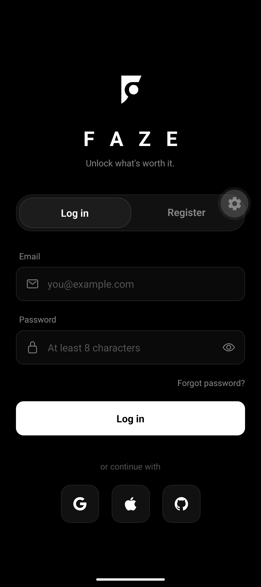
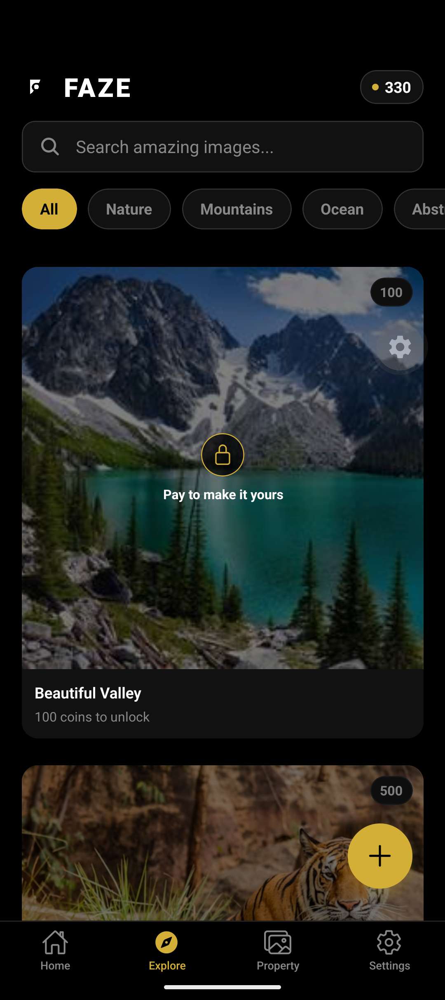
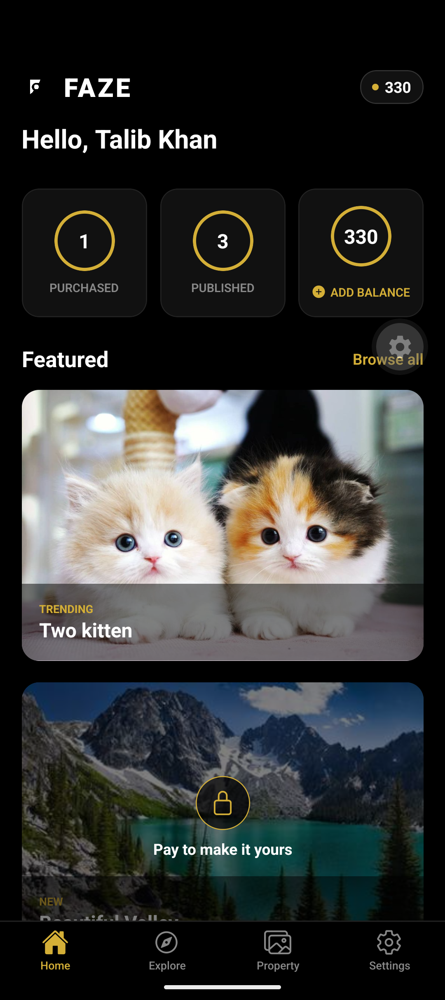
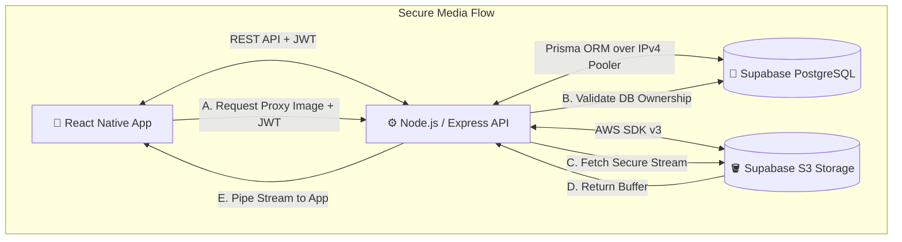
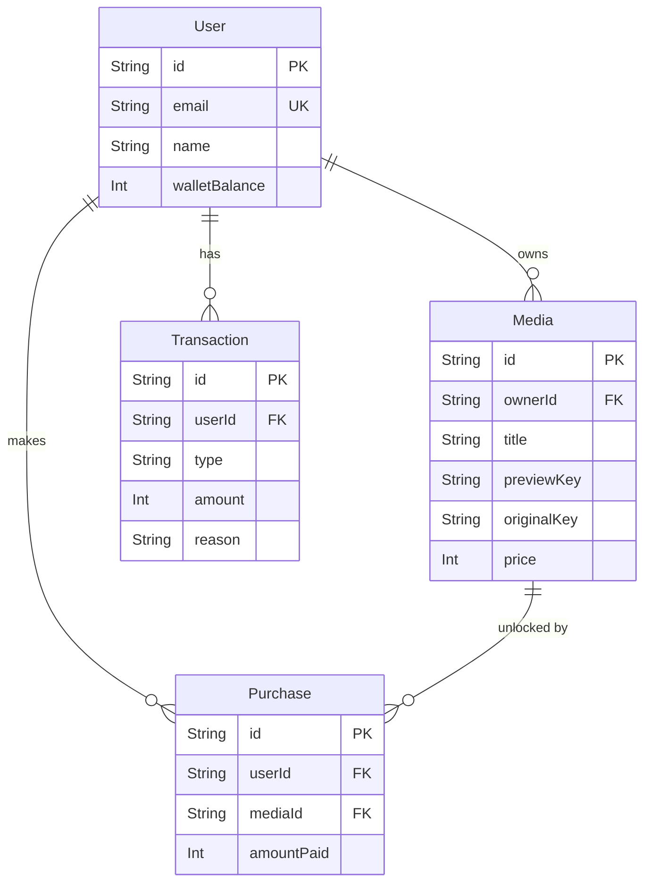

  
  # 🔒 F A Z E
  **Unlock what's worth it.**

  *A Next-Generation Premium Media Locker & Digital Asset Marketplace*

  
  
  
  
  
  
  
  

---

## 📥 Download the App (Android APK)

The application is officially built in the cloud via **Expo Application Services (EAS)**. You can download the production-ready `.apk` directly from the Expo servers.

  
  
   

  

---

## 📱 Application Preview

  
  &nbsp;&nbsp;&nbsp;
  
  &nbsp;&nbsp;&nbsp;
  

---

## 🌟 About FAZE

FAZE is a robust mobile application that allows creators to monetize their premium media. Users upload high-resolution images and attach a coin value. Other users browse heavily compressed, watermarked previews for free. To see the crystal-clear original, users must spend digital coins from their integrated FAZE wallet. 

The entire system is powered by a **Zero-Trust Secure Stream Proxy**, ensuring original files are physically impossible to scrape without an authenticated purchase.

### ✨ Key Features
- **🪙 Internal Digital Economy**: A fully functioning wallet system allowing users to accumulate and spend digital coins.
- **🔒 Secure Media Proxy**: Real-time ownership validation. Original files are streamed securely as buffers directly to the mobile client through an authenticated JWT layer.
- **🎨 Modern Dark UI**: A sleek, premium glassmorphic dark-mode interface built with React Native.
- **☁️ Serverless & Cloud Ready**: Fully containerized backend running on Render, powered by Supabase's high-performance Postgres connection pooler and S3-compatible cloud storage.

---

## 🛡️ Security & Privacy Architecture

> [!IMPORTANT]
> The backend acts as a **Zero-Trust Secure Stream Proxy**. Direct S3 or CDN links are *never* exposed to the client application, ensuring that original media cannot be scraped, shared, or bypassed.

*   **Strict Access Control**: All media access requests are forcefully routed through the `/api/media/proxy` endpoint, which sits entirely behind our JWT authentication middleware.
*   **Private Media Storage**: Original high-resolution files and compressed previews are stored in a private S3 bucket. Public internet access is completely disabled.
*   **Real-Time Ownership Validation**: Before the backend proxy streams any file prefixed with `original-`, it performs a live database transaction via Prisma to verify that the requesting user either natively owns the media or holds a valid `Purchase` record.
*   **Secure Mobile Delivery**: The React Native frontend is securely configured to pass the active session's Bearer token inside the HTTP headers of all native `<Image>` components.

---

## 🏗️ System Architecture

The following diagram illustrates the high-level architecture of FAZE, showing how the mobile client, API backend, database, and S3 storage interact:

---

## 🗄️ Database ER Diagram

The relational PostgreSQL database is managed via Prisma. Here is the Entity-Relationship (ER) model:

---

## 👨‍💻 Author

Built with ❤️ by **Talib Khan**.
